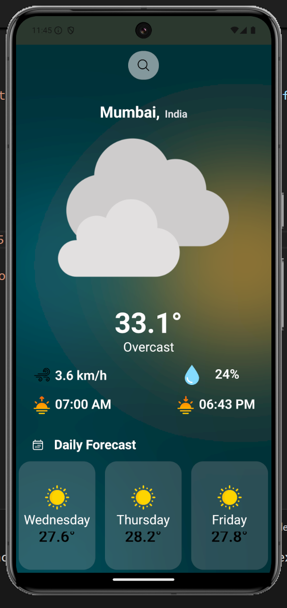

# 🌦 Weather App

A **Weather App** built using **React Native** and the **Weather API**, providing real-time weather information and a 3-day forecast for any searched city worldwide.

## 📌 Features

- 🔍 **Search for any city worldwide**
- 🌤 **Real-time weather updates**
- 🌡 **Temperature, humidity, wind speed, and more**
- 📅 **3-day weather forecast**
- 🎨 **Intuitive and user-friendly UI**
- 📍 **Geolocation-based weather updates**
- 🌙 **Light and dark mode support**

## 🖼 Screenshots



## 🛠 Tech Stack

- **React Native** - Frontend framework
- **Weather API** - Fetching weather data
- **Expo** - Simplified development and testing
- **Axios** - API handling
- **React Navigation** - Screen navigation

## 🚀 Installation & Setup

Follow these steps to set up and run the app locally:

### Prerequisites

- Node.js installed
- React Native development environment set up ([Guide](https://reactnative.dev/docs/environment-setup))
- Weather API key from [WeatherAPI.com](https://www.weatherapi.com/)

### Steps

1. **Clone the repository:**
   ```sh
   git clone https://github.com/Priyansh7999/Weather-App-React-Native-Expo.git
   cd eather-App-React-Native-Expo
   ```
2. **Install dependencies:**
   ```sh
   npm install
   ```

3. **Start the development server:**
   ```sh
   npm start
   ```
4. **Run the app:**
   ```sh
   npm run android  # for Android
   npm run ios      # for iOS (requires macOS)
   ```


## 🏃 Usage

1. Open the app.
2. Use the search bar to enter a city name.
3. View real-time weather updates.
4. Check the forecast for the next 3 days.
5. Toggle between light and dark mode (if available).

## 🔗 API Reference

The app uses the [Weather API](https://www.weatherapi.com/) to fetch weather data. Example API request:

```sh
GET https://api.weatherapi.com/v1/forecast.json?key=YOUR_API_KEY&q=London&days=3
```

## 💡 Contributing

Contributions are welcome! To contribute:

1. Fork the repository
2. Create a new branch (`feature-new-feature`)
3. Commit your changes
4. Push to the branch
5. Open a Pull Request

## 📝 License

This project is licensed under the MIT License.

## 👨‍💻 Author

👤 **Your Name**
GitHub: [@Priyansh7999](https://github.com/Priyansh7999)
LinkedIn: [Priyansh Saxena]([https://www.linkedin.com/in/yourprofile/](https://www.linkedin.com/in/priyansh-saxena-399799254/))
